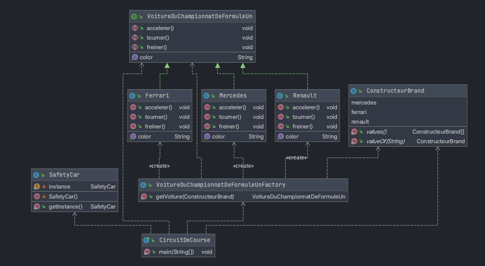

# Réponse au TD dessign pattern CPINFO 2020

Solution developpé en JAVA pour l'exercise suivant 

```
Bonjour,

Voici l’exercice de Design Pattern session 1 / 3
Nous allons modéliser un circuit de course (classe « CircuitDeCourse »).
Ce circuit ne pourra avoir qu’une et une seule « SafetyCar ».
Les voitures participant à la course devront toutes respecter l’interface « VoitureDuChampionnatDeFormuleUn » 
avec des méthodes « accelerer », « tourner » et « freiner » pour êtes mise sur la grille de départ.
Une « VoitureDuChampionnatDeFormuleUn » a un « constructeur »: mercedes, ferrari ou renault et une « couleur » 
suivant le constructeur : noir, rouge, bleu
Les voitures seront mises sur le circuit au travers d’une seul et unique même classe à laquelle vous passez la marque. 
Quelles design pattern allez-vous utiliser ?
Proposer le diagramme UML (en utilisant par exemple PlantUML ou alors une image)
Indiquez les design patterns utilisés à l’aide de commentaires
Proposer une implémentation et son test
Le test devra vérifier que
la safety car est toujours la même
créer les trois voitures
vérifier les couleurs des 3 voitures
Votre projet doit m’être rendu sous forme de projet git que je pourrais cloner depuis internet si possible 
(en utilisant github par exemple).

Je prendrais les commits de vos projets à cette date.
```

J'ai utilisé pour le `SafetyCar` le design pattern `Singleton`et pour les autres voitures le design pattern `Factory`

Et j'ai suivi le diagramme UML que vous voyez à continuation 



